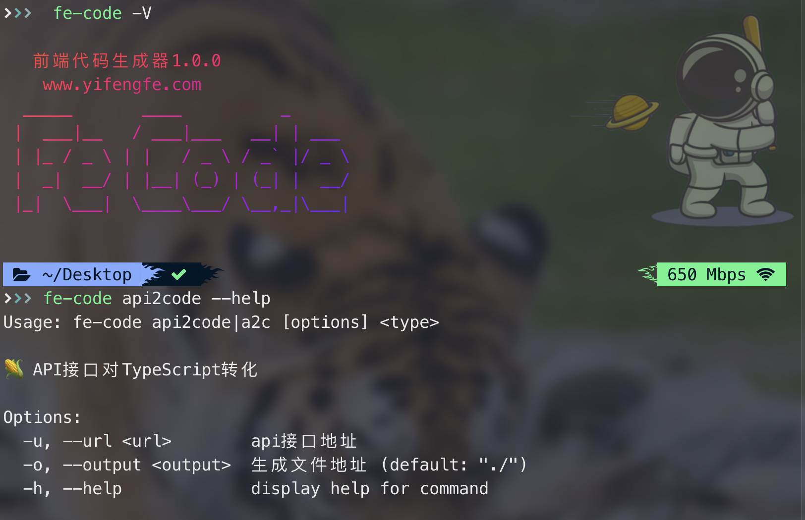

# 🤖 前端代码 no-code 🌈

很多前端同学，每日不仅要忙于内卷，还要忙于奔波在重复的业务逻辑期间，所以我们索性开发了这样一款工具，帮助大家可以直接根据接口生成 CURD 的全部代码，让大家生活多些快乐，功能 todolist：

> - 根据接口生成 ts 的接口声明文档
> - 根据接口直接生成 Vue+TS(js 代码)
> - 根据接口直接生成 React+TS(js 代码)
> - 定制选择指定 UI 组件库，直接根据接口生成
> - 将 JavaScript 代码直接生成 TypeScript 代码


---

## ① 基础命令

```shell
#查看版本号
fe-code -V
#查看帮助文档
fe-code --help
#接口生成TS代码帮助文档
fe-code api2code --help
```




### `api2code`

缩写：`a2c`

#### 参数

```bash
Options:
  -u, --url <url>        （可选）api地址(域名 或 ip) (默认: "http://localhost:3000")
  -p, --path <path>      （可选）api路径
  -b, --body <body>      （可选）post方法中baby的json路径, only post method.
  -i, --input <input>    （可选）输入的json路径
  -o, --output <output>  （必填）输出interface的文件路径
  -h, --help              查看帮助
```


#### 例子🌰

1. 通过请求接口的方式生成interface

   ```bash
   fe-code a2c -o src/index.ts -p /getDetails
   ```

2. 通过本地json方式生成interface

   ```bash
   fe-code a2c -o src/index.ts -i /data.json
   ```

